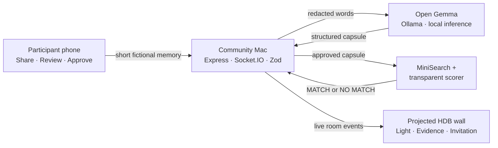

<div align="center">

# 87K Windows

### Lives witnessed. Human threads revealed.

Gemma turns one consented memory into a safe, explainable invitation for another person to listen and learn.

[**Open the live demo**](https://windows-87k-985493069617.asia-southeast1.run.app/join/demo87) · [Wall Mode](https://windows-87k-985493069617.asia-southeast1.run.app/wall/demo87) · [Architecture](docs/ARCHITECTURE.md) · [90-second demo](docs/DEMO_SCRIPT.md)

[](https://github.com/tanveerriaz/87k-windows/actions/workflows/ci.yml)


</div>


<p align="center"><sub>Real hosted Gemma result captured from the local real-model flow. Synthetic stories only.</sub></p>

## Why this exists

Older people are not profiles to complete or companions to simulate. They are witnesses, makers and teachers. Many still have craft, humour and hard-won knowledge to pass on; what is often missing is a clear signal that somebody is genuinely ready to listen.

87K Windows asks one gentle question, lets the participant approve exactly what can be shared, and makes the resulting human bridge visible on a shared Singapore housing block.

> Not an AI companion. An AI that makes a memory legible, finds the bridge, and gets out of the way.

The story direction is informed by Singapore seniors who continue contributing through healthcare, football, modelling and education in CNA's [*Never Too Old*](https://www.youtube.com/watch?v=5eJ8cwojDJg). Every story shipped in this repository remains clearly fictional.

## The four-beat experience

| 01 — You shared | 02 — Gemma noticed | 03 — You approved | 04 — A story matched |
| --- | --- | --- | --- |
| One short memory, spoken or typed | A safe capsule with evidence and uncertainty | Nothing enters matching without consent | A grounded invitation, or `NO MATCH YET` |

The prepared demo is intentionally simple:

- **Your memory:** repairing radios in Queenstown in the 1970s, with an explicit offer to teach.
- **Their interest:** learning how old radios worked.
- **Evidence:** `Queenstown` · `1970s` · `radio repair` · `teach ↔ learn`.
- **Human outcome:** **A potential listener match was found.** The shipped listener is a clearly labelled fictional fixture, not a simulated acceptance from a real person.

<details>
<summary><strong>See the Queenstown visual direction</strong></summary>
<br />


<sub>Original synthetic visual direction generated with Gemini 3.1 Flash Image; implemented with accessible React, semantic HTML and Canvas.</sub>
</details>

## Where Gemma is used

Gemma has one narrow, visible job: turn natural language into a reviewable story capsule.

```text
YOUR WORDS
    │
    ▼
server-side redaction → open Gemma on the local Mac → Zod validation
    │
    ▼
place · era · skill · offer/want · safe summary · uncertainty
    │
    ▼
your approval → transparent deterministic matcher → invitation or NO MATCH YET
```

Gemma does **not** choose a friend, invent a biography, analyse the optional photo, exchange contact details or imitate companionship. Matching is ordinary application logic with visible evidence and a hard threshold.

## Why open Gemma matters

The physical judging demo runs `gemma3:4b` locally through Ollama. Model inference stays on a community-operated Mac, the experience works without internet access, and one laptop can serve phones over a trusted private hotspot. Openness is therefore part of community control—not a model swap inside a generic cloud workflow.

The local prototype uses HTTP between each phone and the Mac, so it must not run on shared event Wi-Fi. `LOCAL GEMMA · ON-DEVICE` describes where inference runs; it is not a claim of encrypted transport.

To match the MacBook Air and `gemma3:4b` demo hardware, local inference deliberately handles one story at a time. Additional submissions receive a clear busy response and can retry after the current capsule is ready; there is no parallel model queue.

The public Cloud Run demo uses hosted Gemma through the Gemini API so remote reviewers can try the same typed provider contract. Both modes are labelled; neither silently falls back to simulated inference.

## Architecture



For the live presentation, one local Node process owns the ephemeral room and serves phones over local Wi-Fi. Cloud Run hosts the same process for online review. There is no account system, database, queue, vector store, analytics SDK or permanent upload storage.

## Run locally

Requirements: Node.js `22.23.x` and npm.

```bash
git clone https://github.com/tanveerriaz/87k-windows.git
cd 87k-windows
npm ci
npm test
```

Start one real-model path:

```bash
npm run demo:local  # primary live demo: native Ollama with gemma3:4b
npm run demo:gemma  # online path: hosted Gemma; key stays server-side
```

Open the three surfaces:

| Surface | Local route | Purpose |
| --- | --- | --- |
| Join | `http://<MAC-LAN-IP>:3000/join/demo87` | Share, review and approve |
| Wall | `http://<MAC-LAN-IP>:3000/wall/demo87` | Project the collective moment |
| Admin | `http://<MAC-LAN-IP>:3000/admin/demo87` | Reset and run the prepared story |

For the hosted path, provide the key without putting it in shell history, browser code or any `VITE_*` variable:

```bash
read -s "GEMINI_API_KEY?Gemini API key: "
export GEMINI_API_KEY
npm run demo:gemma
unset GEMINI_API_KEY
```

## Real-model reliability

| Mode | Model | Role |
| --- | --- | --- |
| Presentation Mac | `gemma3:4b` through native Ollama | Primary judging path: on-device and offline-capable |
| Cloud Run | hosted Gemma 4 through the Gemini API | Public path for online reviewers |
| Deterministic harness | synthetic fixture provider | Automated tests and UI development only |

If neither real model is available, the judged demo stops honestly. It never silently falls back to simulated inference.

## Trust boundaries

- Synthetic stories and generated, non-identifying artwork only.
- Raw memory text and optional image previews are not persisted.
- The optional photo stays in the browser and is never sent to Gemma.
- Obvious contact details are removed before hosted inference.
- Model output is schema-constrained, validated and safely rejected when malformed.
- Weak evidence returns `NO MATCH YET`; no invitation is invented.
- No hidden chain-of-thought is shown—only evidence, uncertainty and missing information.

## Repository map

```text
src/client/       Join, Wall and Admin surfaces
src/server/       inference, matching and ephemeral rooms
src/shared/       schemas, events and prepared demo copy
data/             fictional synthetic story fixtures
assets/           generated artwork, prompts and provenance
tests/            unit, integration and two-tab browser flow
docs/             architecture, deployment and submission guides
```

## Verify the complete slice

```bash
npm run lint
npm run typecheck
npm test
npm run build
npm run test:e2e
npm run verify:machine
```

The critical browser test uses two contexts: participant submission must update Wall Mode, produce the Queenstown radio connection, survive a wall reload, and then refuse the deliberate negative fixture.

## Documentation

- [Hackathon submission](docs/SUBMISSION.md)
- [Architecture](docs/ARCHITECTURE.md)
- [90-second demo script](docs/DEMO_SCRIPT.md)
- [Google Cloud Run deployment](docs/GCP_DEPLOYMENT.md)
- [Generated asset provenance](docs/ASSET_PROVENANCE.md)

## Licence

No software licence has been selected yet.
