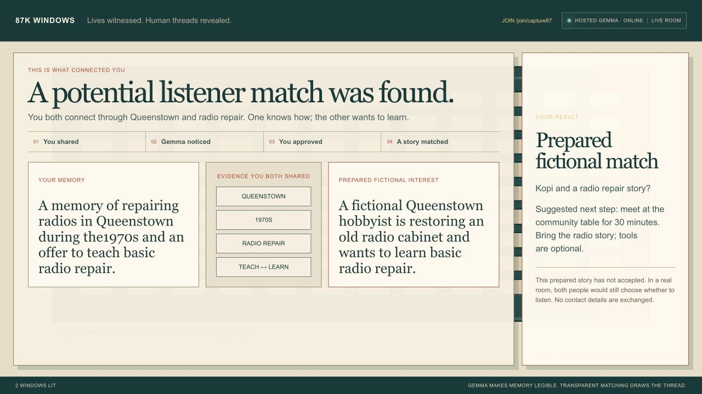
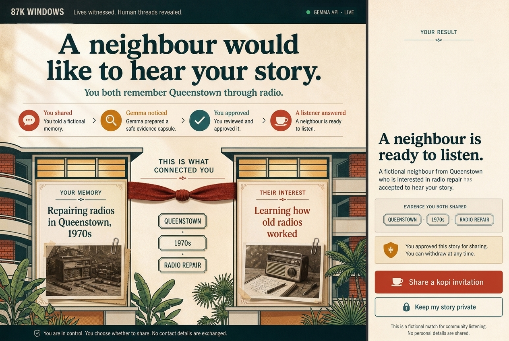
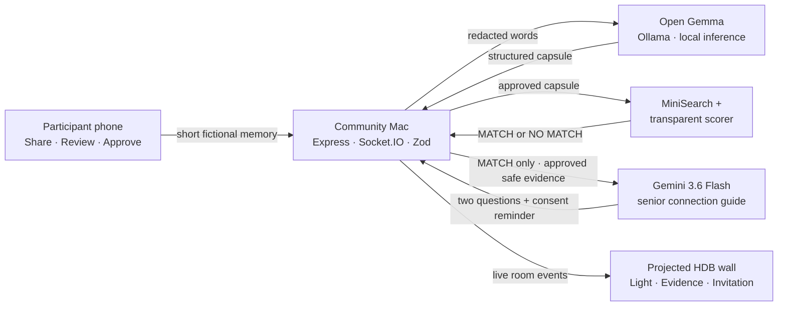

<div align="center">

# 87K Windows

### One life remembers. Another life needs it. A human connection begins.

87K Windows helps older people turn joyful lived experience into a consented offer—something another person can hear, learn from or share—so memory becomes social connection.

[**Open the Cloud Run app**](https://windows-87k-985493069617.asia-southeast1.run.app/) · [Submission video](output/video/87k-windows-submission-final.mp4) · [Join Mode](https://windows-87k-985493069617.asia-southeast1.run.app/join/demo87) · [Wall Mode](https://windows-87k-985493069617.asia-southeast1.run.app/wall/demo87) · [Architecture](docs/ARCHITECTURE.md) · [Demo story](docs/DEMO_SCRIPT.md)

[](https://github.com/tanveerriaz/87k-windows/actions/workflows/ci.yml)


</div>


<p align="center"><sub>The building is generated fictional artwork. Live Canvas light—not a fabricated façade—shows when approved evidence connects two lives.</sub></p>

## Why this exists

Older people are not only people who may need support. They carry knowledge, skills and experiences that somebody else may need. They are witnesses, makers and teachers; what is often missing is a clear signal that somebody is genuinely ready to listen, learn or share the joy.

87K Windows asks one gentle question, turns lived experience into a consented offer, and lets the participant approve exactly what can be shared. A real-looking Singapore housing block then makes the result visible: one warm light when a story has been witnessed; two lights and a thread only when the evidence holds.

> Not an AI companion. Gemini creates a safe beginning, then gets out of the way so two people can talk.

The story direction is informed by Singapore seniors who continue contributing through healthcare, football, modelling and education in CNA's [*Never Too Old*](https://www.youtube.com/watch?v=5eJ8cwojDJg). Every story shipped in this repository remains clearly fictional.

## The Track 2 experience

| 01 — You shared | 02 — Gemma protected | 03 — You approved | 04 — Evidence matched | 05 — Gemini guides |
| --- | --- | --- | --- | --- |
| One short memory, spoken or typed | A local safe capsule with uncertainty | Nothing enters matching without consent | Transparent code returns a match or `NO MATCH YET` | Two gentle questions can be read aloud slowly |

The prepared demo is intentionally simple:

- **Your memory:** repairing radios in Queenstown in the 1970s, with an explicit offer to teach.
- **Their interest:** learning how old radios worked.
- **Evidence:** `Queenstown` · `1970s` · `radio repair` · `teach ↔ learn`.
- **Human outcome:** **A potential listener match was found.** The shipped listener is a clearly labelled fictional fixture, not a simulated acceptance from a real person.



<p align="center"><sub>Proof, not a mockup: the real-model flow produced this evidence-backed result. Synthetic stories only.</sub></p>

<details>
<summary><strong>See the Queenstown visual direction</strong></summary>
<br />



<sub>Original synthetic visual direction generated with Gemini 3.1 Flash Image; implemented with accessible React, semantic HTML and Canvas.</sub>
</details>

## Where Gemini and Gemma are used

The models have different, visible jobs. Gemini is the senior-facing Track 2 intelligence. Gemma is the local privacy layer.

```text
YOUR WORDS
    │
    ▼
server-side redaction → open Gemma on the local Mac → Zod validation
    │
    ▼
place · era · skill · offer/want · safe summary · uncertainty
    │
    ▼
your approval → transparent matcher → MATCH or NO MATCH YET
                                      │
                        MATCH only     ▼
approved safe capsules + visible evidence → Gemini 3.6 Flash
                                      │
                                      ▼
two senior-friendly questions + pause/stop reminder + Read aloud
```

Gemini never receives raw memory text, photos, contact details or unmatched submissions. It cannot choose a match or change its confidence. Gemma does **not** choose a friend, invent a biography, analyse the optional photo, exchange contact details or imitate companionship. Matching is ordinary application logic with visible evidence and a hard threshold.

## Why open Gemma matters

The physical judging demo runs `gemma3:4b` locally through Ollama for the privacy-sensitive first pass, while server-side `gemini-3.6-flash` produces the consent-first senior guide. One laptop serves zero-install phone clients over a trusted private hotspot; participants do not install Ollama or either model.

The local prototype uses HTTP between each phone and the Mac, so it must not run on shared event Wi-Fi. `LOCAL GEMMA · ON-DEVICE` describes where inference runs; it is not a claim of encrypted transport.

To match the MacBook Air and `gemma3:4b` demo hardware, local inference deliberately handles one story at a time. Additional submissions receive a clear busy response and can retry after the current capsule is ready; there is no parallel model queue.

The public Cloud Run demo uses hosted Gemma for extraction and Gemini 3.6 Flash for the same post-match guide. Every active model is labelled; neither silently falls back to simulated inference.

## Architecture



For the live presentation, one local Node process owns the ephemeral room and serves phones over local Wi-Fi. Cloud Run hosts the same process for online review. There is no account system, database, queue, vector store, analytics SDK or permanent upload storage.

## Run locally

Requirements: Node.js `22.23.x` and npm.

```bash
git clone https://github.com/tanveerriaz/87k-windows.git
cd 87k-windows
npm ci
npm test
```

Start the Track 2 judging path:

```bash
read -s "GEMINI_API_KEY?Gemini API key: "
export GEMINI_API_KEY
npm run demo:judge  # local Gemma + server-side Gemini 3.6 Flash
unset GEMINI_API_KEY
```

`npm run demo:local` is the offline Gemma-only recovery path. `npm run demo:gemma` is the hosted Gemma + Gemini online path.

Open the three surfaces:

| Surface | Local route | Purpose |
| --- | --- | --- |
| Join | `http://<MAC-LAN-IP>:3000/join/demo87` | Share, review and approve |
| Wall | `http://<MAC-LAN-IP>:3000/wall/demo87` | Project the collective moment |
| Admin | `http://<MAC-LAN-IP>:3000/admin/demo87` | Reset and run the prepared story |

For the hosted path, provide the key without putting it in shell history, browser code or any `VITE_*` variable:

```bash
read -s "GEMINI_API_KEY?Gemini API key: "
export GEMINI_API_KEY
npm run demo:gemma
unset GEMINI_API_KEY
```

## Real-model reliability

| Mode | Model | Role |
| --- | --- | --- |
| Mode | Extraction | Senior facilitation | Role |
| --- | --- | --- | --- |
| `demo:judge` | local `gemma3:4b` | `gemini-3.6-flash` | Primary Track 2 judging path |
| `demo:gemma` / Cloud Run | hosted Gemma 4 | `gemini-3.6-flash` | Public online-review path |
| `demo:local` | local `gemma3:4b` | disabled | Offline recovery; not the complete Track 2 story |
| Test harness | deterministic fixtures | deterministic guide | Automated checks only |

If neither real model is available, the judged demo stops honestly. It never silently falls back to simulated inference.

## Trust boundaries

- Synthetic stories and generated, non-identifying artwork only.
- Raw memory text and optional image previews are not persisted.
- The optional photo stays in the browser and is never sent to Gemma.
- Obvious contact details are removed before hosted inference.
- Gemini receives only approved safe capsules after a valid match; no-match never calls it.
- Model output is schema-constrained, validated and safely rejected when malformed.
- Weak evidence returns `NO MATCH YET`; no invitation is invented.
- No hidden chain-of-thought is shown—only evidence, uncertainty and missing information.

## Repository map

```text
src/client/       Join, Wall and Admin surfaces
src/server/       inference, matching and ephemeral rooms
src/shared/       schemas, events and prepared demo copy
data/             fictional synthetic story fixtures
assets/           generated artwork, prompts and provenance
tests/            unit, integration and two-tab browser flow
docs/             architecture, deployment and submission guides
```

## Verify the complete slice

```bash
npm run lint
npm run typecheck
npm test
npm run build
npm run test:e2e
npm run verify:machine
```

The critical browser test uses two contexts: participant submission must update Wall Mode, produce the Queenstown radio connection, survive a wall reload, and then refuse the deliberate negative fixture.

## Documentation

- [Hackathon submission](docs/SUBMISSION.md)
- [Architecture](docs/ARCHITECTURE.md)
- [90-second demo script](docs/DEMO_SCRIPT.md)
- [Google Cloud Run deployment](docs/GCP_DEPLOYMENT.md)
- [Generated asset provenance](docs/ASSET_PROVENANCE.md)

## Licence

No software licence has been selected yet.
