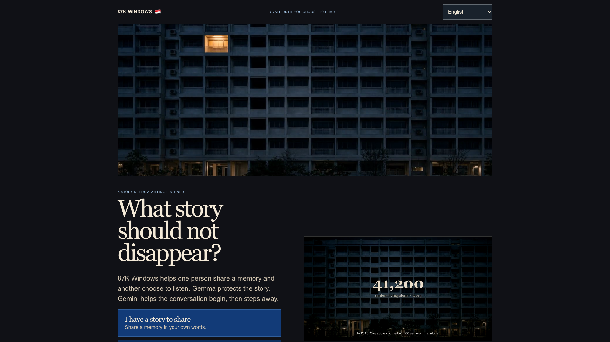
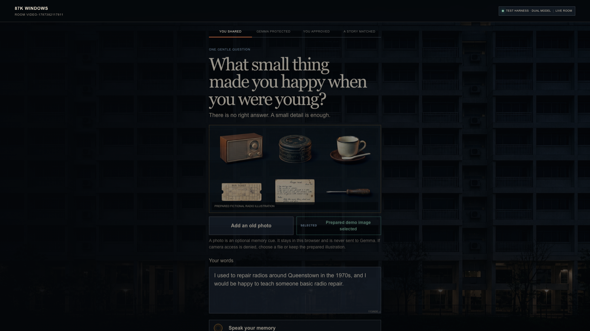
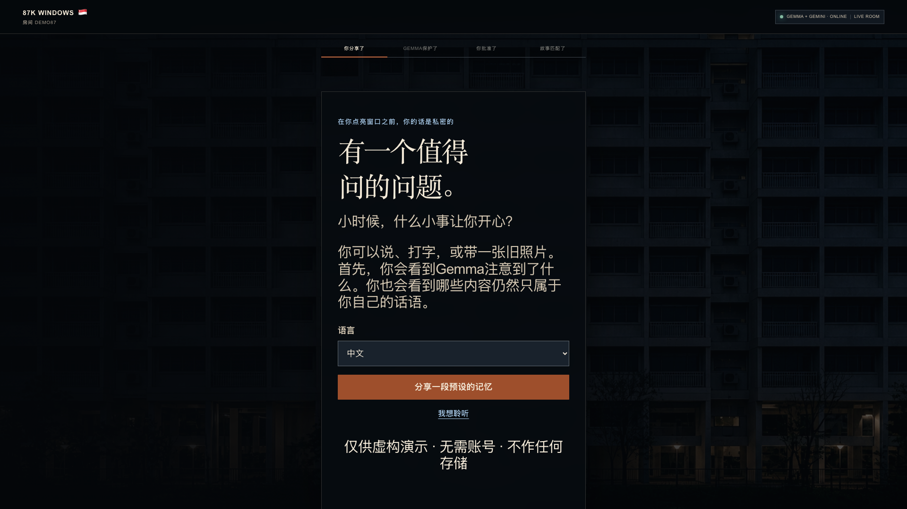
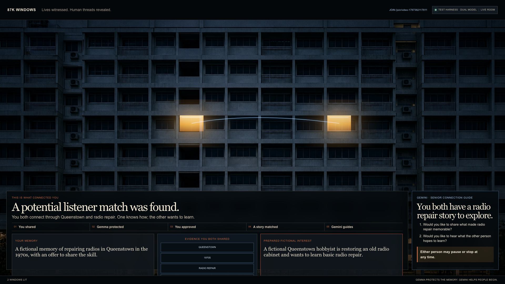
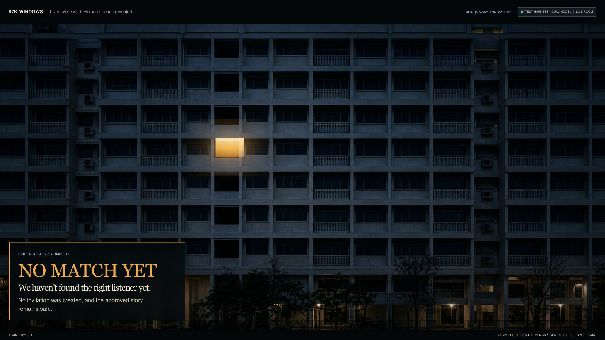
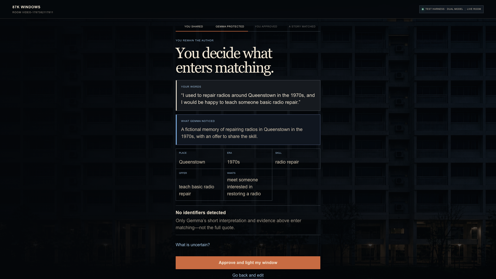
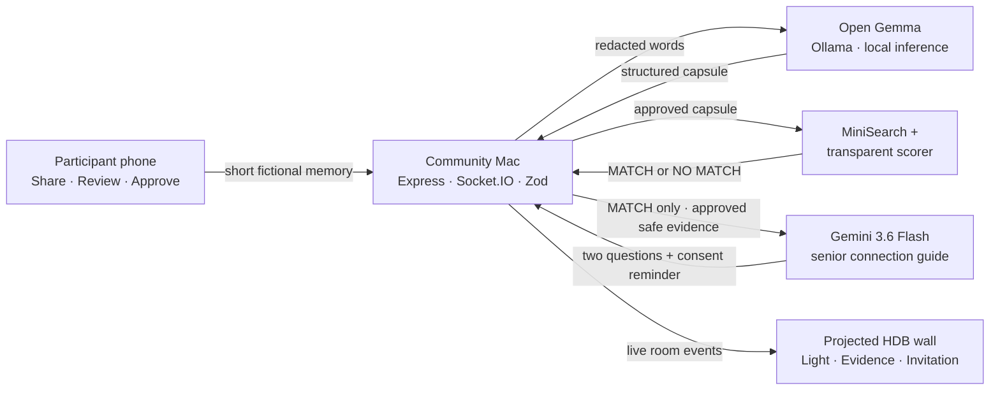

<div align="center">

# 87K Windows

### One life remembers. Another life needs it. A human connection begins.

87K Windows helps older people turn joyful lived experience into a consented offer—something another person can hear, learn from or share—so memory becomes social connection.

[**Open the live app**](https://87k-windows.up.railway.app/) · [Submission video](output/video/87k-windows-submission-final.mp4) · [Landing story film](public/landing-story.mp4) · [Join](https://87k-windows.up.railway.app/join/demo87) · [Wall](https://87k-windows.up.railway.app/wall/demo87) · [Admin](https://87k-windows.up.railway.app/admin/demo87) · [Architecture](docs/ARCHITECTURE.md) · [Demo story](docs/DEMO_SCRIPT.md)

The landing page opens with an ~83-second parallel story film — an elder with a story and a newcomer who needs it, in the same block — that explains why the product is named for Singapore's ~87,000 seniors living alone. Real HDB window lights loop in the façade band above the film. Script and sources: [docs/video/landing-story-script.md](docs/video/landing-story-script.md).

The whole journey runs in Singapore's four official languages — English, 中文, Bahasa Melayu, தமிழ் — and stories still match across languages.

[](https://github.com/tanveerriaz/87k-windows/actions/workflows/ci.yml)


</div>



<p align="center"><sub>The live Railway surface (captured 2026-08-24): sitewide <strong>87K WINDOWS 🇸🇬</strong> home link, real-window façade lights, parallel landing film, language choice in the nav, then storyteller / listener choice. The building is fictional generated artwork; live Canvas light on Wall Mode shows when approved evidence connects two lives.</sub></p>

## Why this exists

Older people are not only people who may need support. They carry knowledge, skills and experiences that somebody else may need. They are witnesses, makers and teachers; what is often missing is a clear signal that somebody is genuinely ready to listen, learn or share the joy.

87K Windows asks one gentle question, turns lived experience into a consented offer, and lets the participant approve exactly what can be shared. A real-looking Singapore housing block then makes the result visible: one warm light when a story has been witnessed; two lights and a thread only when the evidence holds.

> Not an AI companion. Gemini creates a safe beginning, then gets out of the way so two people can talk.

The story direction is informed by Singapore seniors who continue contributing through healthcare, football, modelling and education in CNA's [*Never Too Old*](https://www.youtube.com/watch?v=5eJ8cwojDJg). Every story shipped in this repository remains clearly fictional.

## The Track 2 experience

| 01 — You shared | 02 — Gemma protected | 03 — You approved | 04 — Evidence matched | 05 — Gemini guides |
| --- | --- | --- | --- | --- |
| One short memory, spoken or typed | A local safe capsule with uncertainty | Nothing enters matching without consent | Transparent code returns a match or `NO MATCH YET` | Two gentle questions can be read aloud slowly |



The prepared demo is intentionally simple:

- **Your memory:** repairing radios in Queenstown in the 1970s, with an explicit offer to teach.
- **Their interest:** learning how old radios worked.
- **Evidence:** `Queenstown` · `1970s` · `radio repair` · `teach ↔ learn`.
- **Human outcome:** **A potential listener match was found.** The shipped listener is a clearly labelled fictional fixture, not a simulated acceptance from a real person.

## 🌏 Four languages, one wall

A senior chooses their language once — on the landing nav or the join screen — and everything follows: the questions on screen, voice input, the read-aloud voice, Gemma's summary of their memory, and Gemini's conversation guide.



<p align="center"><sub>The live join screen in Mandarin (captured 2026-08-24). The same screen exists in English, Bahasa Melayu and Tamil.</sub></p>

How it stays matchable across languages:

- Gemma writes the **safe summary in the participant's language**, but always writes the matching evidence (`place` · `era` · `skills` · `offers` · `wants`) in **canonical English** — so a Mandarin memory about 女皇镇 and an English listener who wants to learn radio repair still connect through `Queenstown`.
- The Gemini guide is written in the **storyteller's language**, with an English rendering added only when the two participants chose different languages.
- The consent gate checks the participant's **raw words** for explicit offer/want phrases in their own language, with negation-aware, fail-closed matching — "我不愿意教" ("I am *not* willing to teach") never counts as an offer.
- Voice input and read-aloud follow the chosen language, and hide honestly on phones that lack a matching voice instead of failing silently.
- Dialects (Hokkien, Teochew, Cantonese) are out of scope: browser speech recognition cannot transcribe them.

> ⚠️ The non-English strings are machine-drafted and pending native-speaker review — see [TRANSLATION-REVIEW.md](TRANSLATION-REVIEW.md). The consent phrase lists in its §1.1 are the rows that matter most.



<p align="center"><sub>Two lights and the blue thread appear only after the Queenstown radio evidence clears the deterministic threshold.</sub></p>



<p align="center"><sub>Weak evidence keeps one light and returns <code>NO MATCH YET</code>. No connection is fabricated.</sub></p>

<details>
<summary><strong>See the consent-first review step</strong></summary>
<br />



<sub>The participant remains the author: extracted evidence is reviewed before it can light a window or enter matching.</sub>
</details>

## Where Gemini and Gemma are used

The models have different, visible jobs. Gemini is the senior-facing Track 2 intelligence. Gemma is the local privacy layer.

```text
YOUR WORDS
    │
    ▼
server-side redaction → open Gemma on the local Mac → Zod validation
    │
    ▼
place · era · skill · offer/want · safe summary · uncertainty
    │
    ▼
your approval → transparent matcher → MATCH or NO MATCH YET
                                      │
                        MATCH only     ▼
approved safe capsules + visible evidence → Gemini 3.6 Flash
                                      │
                                      ▼
two senior-friendly questions + pause/stop reminder + Read aloud
```

Gemini never receives raw memory text, photos, contact details or unmatched submissions. It cannot choose a match or change its confidence. Gemma does **not** choose a friend, invent a biography, analyse the optional photo, exchange contact details or imitate companionship. Matching is ordinary application logic with visible evidence and a hard threshold.

## Why open Gemma matters

The physical judging demo runs `gemma3:4b` locally through Ollama for the privacy-sensitive first pass, while server-side `gemini-3.6-flash` produces the consent-first senior guide. One laptop serves zero-install phone clients over a trusted private hotspot; participants do not install Ollama or either model.

The local prototype uses HTTP between each phone and the Mac, so it must not run on shared event Wi-Fi. `LOCAL GEMMA · ON-DEVICE` describes where inference runs; it is not a claim of encrypted transport.

To match the MacBook Air and `gemma3:4b` demo hardware, local inference deliberately handles one story at a time. Additional submissions receive a clear busy response and can retry after the current capsule is ready; there is no parallel model queue.

The public Railway app runs the OpenRouter path: hosted `google/gemma-3-27b-it` for extraction and `google/gemini-3.6-flash` for the same post-match guide. Every active model is labelled on Join / Wall / Admin; neither silently falls back to simulated inference. See [Railway deployment](docs/RAILWAY_DEPLOYMENT.md).

## Architecture



For the live presentation, one local Node process owns the ephemeral room and serves phones over local Wi-Fi. Railway hosts the same process for online review. There is no account system, database, queue, vector store, analytics SDK or permanent upload storage.

## Run locally

Requirements: Node.js `22.23.x` and npm.

```bash
git clone https://github.com/tanveerriaz/87k-windows.git
cd 87k-windows
npm ci
npm test
```

Start the Track 2 judging path:

```bash
read -s "GEMINI_API_KEY?Gemini API key: "
export GEMINI_API_KEY
npm run demo:judge  # local Gemma + server-side Gemini 3.6 Flash
unset GEMINI_API_KEY
```

`npm run demo:local` is the offline Gemma-only recovery path. `npm run demo:gemma` is the hosted Gemma + Gemini online path.

Open the surfaces:

| Surface | Local route | Purpose |
| --- | --- | --- |
| Landing | `http://<MAC-LAN-IP>:3000/` | Story film, façade lights, storyteller / listener choice |
| Join | `http://<MAC-LAN-IP>:3000/join/demo87` | Share, review and approve |
| Wall | `http://<MAC-LAN-IP>:3000/wall/demo87` | Project the collective moment |
| Admin | `http://<MAC-LAN-IP>:3000/admin/demo87` | Reset and run the prepared story |

For the hosted path, provide the key without putting it in shell history, browser code or any `VITE_*` variable:

```bash
read -s "GEMINI_API_KEY?Gemini API key: "
export GEMINI_API_KEY
npm run demo:gemma
unset GEMINI_API_KEY
```

## Real-model reliability

| Mode | Extraction | Senior facilitation | Role |
| --- | --- | --- | --- |
| `demo:judge` | local `gemma3:4b` | `gemini-3.6-flash` | Primary Track 2 judging path |
| Railway (live) | OpenRouter `google/gemma-3-27b-it` | OpenRouter `google/gemini-3.6-flash` | Public online-review path |
| `demo:gemma` | hosted Gemma via Gemini API | `gemini-3.6-flash` | Alternate hosted local launch |
| `demo:local` | local `gemma3:4b` | disabled | Offline recovery; not the complete Track 2 story |
| Test harness | deterministic fixtures | deterministic guide | Automated checks only |

If neither real model is available, the judged demo stops honestly. It never silently falls back to simulated inference.

## Trust boundaries

- Synthetic stories and generated, non-identifying artwork only.
- Raw memory text and optional image previews are not persisted.
- The optional photo stays in the browser and is never sent to Gemma.
- Obvious contact details are removed before hosted inference.
- Gemini receives only approved safe capsules after a valid match; no-match never calls it.
- Model output is schema-constrained, validated and safely rejected when malformed.
- Weak evidence returns `NO MATCH YET`; no invitation is invented.
- Offers and wants only enter matching when the participant's raw words contain an explicit consent phrase in their own language; the check is deterministic, negation-aware and fails closed.
- No hidden chain-of-thought is shown—only evidence, uncertainty and missing information.
- Contact-detail redaction patterns are English-oriented today; extending them per language is a named prerequisite before any non-synthetic multilingual data.

## Repository map

```text
src/client/       Landing, Join, Wall and Admin surfaces
src/server/       inference, matching and ephemeral rooms
src/shared/       schemas, events and prepared demo copy
public/           landing story film, façade clip and web statics
data/             fictional synthetic story fixtures
assets/           generated artwork, prompts and provenance
tests/            unit, integration and two-tab browser flow
docs/             architecture, deployment, video script and submission guides
```

## Verify the complete slice

```bash
npm run lint
npm run typecheck
npm test
npm run build
npm run test:e2e
npm run verify:machine
```

The critical browser test uses two contexts: participant submission must update Wall Mode, produce the Queenstown radio connection, survive a wall reload, and then refuse the deliberate negative fixture.

## Documentation

- [Hackathon submission](docs/SUBMISSION.md)
- [Architecture](docs/ARCHITECTURE.md)
- [90-second demo script](docs/DEMO_SCRIPT.md)
- [Landing story film script](docs/video/landing-story-script.md)
- [Railway deployment](docs/RAILWAY_DEPLOYMENT.md)
- [Google Cloud Run deployment](docs/GCP_DEPLOYMENT.md) (hackathon ephemeral project; archived)
- [Generated asset provenance](docs/ASSET_PROVENANCE.md)

## Creator

Built by [Tanveer Riaz](https://tanveerriaz.me/) during a hackathon — AI specialist and systems builder in Singapore.

**Curious mind. Builder mode! 🇸🇬**

[tanveerriaz.me](https://tanveerriaz.me/) · [GitHub · 87k-windows](https://github.com/tanveerriaz/87k-windows)

## Licence

No software licence has been selected yet.
